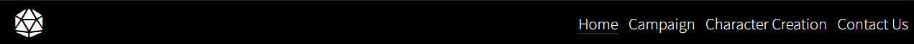
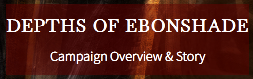

<h1 align="center">The Depths of Ebonshade Website</h1>

## Introduction
The Depths of Ebonshade is a site to provide all information regarding the Dungeons and Dragons campign "The Depths of Ebonshade". The site is targeted towards people who want to experience more of the niche horror Dungeons and Dragons can provide. The site will also provide additional information for any aspiring DMs who are getting into leading horror campaigns.

[View the live project here.](add link to completed project)

<h2 align="center"></h2>

## User Experience (UX)

-   ### User Stories

    -   #### First Time Visitor Goals

        * As a First Time user, I want to understand the main purpose of this site.
        * As a First Time user, I want to know this is the kind of campaign I want to run.
        * As a First Time user, I want to know the length of time the campaign will take.
        * As a First Time user I want to easily find information about the story.
        * As a First Time user, I want to gain access to the campaign.
        

    -   #### Returning Visitor Goals 

        * As a returning user, I want to find information about the characters.
        * As a returning user, I want to find information about the world.
        * As a returning user, I want to find community links.

    -   #### Frequent User Goals

        * As a Frequent User, I want to be able to access relevant information quickly.
        * As a Frequent User, I want access to character sheets.
        * As a Frequent user, I want to access the character and race stats.
        * As a Frequent user, I want access to external sources to provide a more enthralling campaign.

    -   #### Author Goals

        * As an Author, I want users to be immediately drawn into to the website.
        * As an Author, I want to promote user interaction via our social media channels.
        * As an Author, I want the campaign to be shared to gain notirotity for my further works.  

### Opportunities/Problems

|Opportunities | Importance | Viability / Feasibility
|-----|:------:|:-----:|
|**Entice the user using interactive design** | 5 | 5 |
|**Responsive site for mobile and tablet** | 5 | 5 |
|**Provide details of the campaign**  | 5 | 5 |
|**Provide ease of access to information** | 5 | 5 |
|**Encourage users to return to the site** | 5 | 5 |
|**To build a community**   | 5 | 4 |
|**Encourage users to share the campaign** | 4 | 4 |
|**Provide a single point of reference to useful external resources** | 3 | 4 |

### Wireframe mockups
To produce a basic mockup of the site layouts I used Balsamiq. 

* [Home page wireframe](assests/wireframes/homepage-wireframe.png)
* [Overview page wireframe](assests/wireframes/overview-wireframe.png)
* [Character Creation page wire frame](assests/wireframes/charactercreation-wireframe.png)
* [Contact page wire frame](assests/wireframes/contact-wireframe.png)

There were necessary deviations from the wireframe regarding copyright concerns, initally I had aimed to include a free soundcloud track that users could interact with an listen however looking further into Soundclouds copyright terms and coditions I was unsure if this would be fair use so have instead removed it and kept a clickable link that sends you straight to the soundcloud album and user as this information is important to the user, as is the case with the youtube video by How to be a Great DM. 

* [Original Soundcloud Interact](assests/media/ux-changes/soundcloud-issue.png)
* [UX of Soundcloud and Youtube link](assests/media/ux-changes/link-only.png)

### Design

Following the overall structure of the wireframes being established, I first set out to find stock images that would relate to a niche horror fantasy without compromising on the aesthetic. I needed a hero image that immediately caught the user’s focus and explained the webpage on its own. After going through unsplash and pexels for a couple of days I was able to find what matched the asthetic I was targetting on shutterstock [https://www.shutterstock.com/](https://www.shutterstock.com/g/WarmTail?searchterm=)

* [Image Collection](assests/media/image-collage.png)
* [Final Image](assests/images/hero-2560.jpg)

### Color Scheme

The image then dictated the color scheme design focus, the goal then became to have striking contrasts that mentally relate to horror but for a contrasting perspective, I needed to clear visible text as the purpose of the website is to draw the user in and give them the information they want to come back to.

By testing different rgba shades of red to match up with my hero image I chose I compared contrasting colors using [https://webaim.org/resources/contrastchecker/](https://webaim.org/resources/contrastchecker/) of which white (#FFFFFF) gave a good contrast. 

To give a container contrast for the main body of text I used a grey background color which gave a suitable contrast ratio, however later on in development this was changed to black. The black to white contrast is the highest contrast and suited the theme of the website and the goal of making the information stand out. 

* [Red Contrast Check](assests/media/ux-changes/contrast-red.png)
* [Grey Contrast Check](assests/media/ux-changes/grey-contrast.png)
* [Black Contrast Check](assests/media/ux-changes/contrast-black.png)
* [Previous Grey container](assests/media/ux-changes/grey-container.png)
* [Final Black container](assests/media/ux-changes/black-container.png)

<h2 align="center">Features</h2>

## Common Features

* Navigation Bar

    - The navigation bar is common across the whole site appearing on all 4 pages.
    - The navigation bar contains links to the home page, campaign, character creation and contact page to give the user simple navigation around the website.
    - The logo has been added to the navigation bar as an additional link back to the home page.
    - The logo item was imported using font awesome the choice of the logo was straight forward a d20 dice is synonymous with D&D.
    - The navigation bar is fully responsive with the nav bar change at two media sizes to give a smoother transition. 
    -  A hover over feature has been added so the users can see what navigation option they are currently selecting.
    - An active class has been set for the page the user is currently on, this is shown via a white underline beneath the text which is shown below. 

    

* Footer 

    - The footer section is common to every page across the site, the footer includes links to each social media platform, currently all these links send you straight to the main social media page as this campaign is yet to be added to these platforms excluding the discord link. The discord link sends you an invite to a server I set up.
    - The link items were imported using font awesome using the script at the bottom of the page. 
    - Included is a copyright notice including my name.

* Banner Title Card

    - The banner card is common to every page but the home page, this is to keep a consistant theme that is contrasted by the changing banner photos. The banner card is shown below.
    - The banner card is fully responsive with moblie devices as an issue arised with it overlapping the main body of text on each page. 

    

* Text Container

    - Each page's body of text is incased in this container it ensures the design remains consistent across the site.
    - This is made fully responsive where at 1024px the container expands to the full page width prevent the text from looking squashed in. 

    * [Container without media query](assests/media/container-without-med.png)
    * [Container with media query](assests/media/container-with-med.png)

## Home Page Features

        
