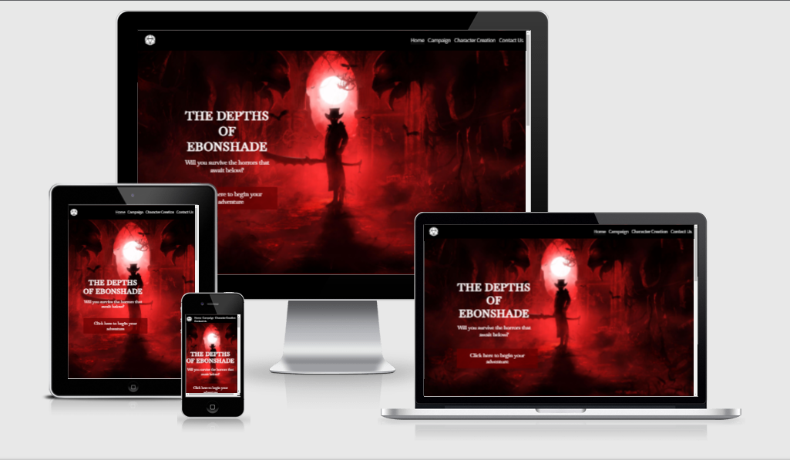

<h1 align="center">The Depths of Ebonshade Website</h1>

## Introduction
The Depths of Ebonshade is a site to provide all information regarding the Dungeons and Dragons campign "The Depths of Ebonshade". The site is targeted towards people who want to experience more of the niche horror Dungeons and Dragons can provide. The site will also provide additional information for any aspiring DMs who are getting into leading horror campaigns.

[View the live project here.](add link to completed project)

<h2 align="center"></h2>

## User Experience (UX)

-   ### User Stories

    -   #### First Time Visitor Goals

        * As a First Time user, I want to understand the main purpose of this site.
        * As a First Time user, I want to know this is the kind of campaign I want to run.
        * As a First Time user, I want to know the length of time the campaign will take.
        * As a First Time user I want to easily find information about the story.
        * As a First Time user, I want to gain access to the campaign.
        

    -   #### Returning Visitor Goals 

        * As a returning user, I want to find information about the characters.
        * As a returning user, I want to find information about the world.
        * As a returning user, I want to find community links.

    -   #### Frequent User Goals

        * As a Frequent User, I want to be able to access relevant information quickly.
        * As a Frequent User, I want access to character sheets.
        * As a Frequent user, I want to access the character and race stats.
        * As a Frequent user, I want access to external sources to provide a more enthralling campaign.

    -   #### Author Goals

        * As an Author, I want users to be immediately drawn into to the website.
        * As an Author, I want to promote user interaction via our social media channels.
        * As an Author, I want the campaign to be shared to gain notirotity for my further works.  

### Opportunities/Problems

|Opportunities | Importance | Viability / Feasibility
|-----|:------:|:-----:|
|**Entice the user using interactive design** | 5 | 5 |
|**Responsive site for mobile and tablet** | 5 | 5 |
|**Provide details of the campaign**  | 5 | 5 |
|**Provide ease of access to information** | 5 | 5 |
|**Encourage users to return to the site** | 5 | 5 |
|**To build a community**   | 5 | 4 |
|**Encourage users to share the campaign** | 4 | 4 |
|**Provide a single point of reference to useful external resources** | 3 | 4 |

### Wireframe mockups
To produce a basic mockup of the site layouts I used Balsamiq. 

* [Home page wireframe](assests/wireframes/homepage-wireframe.png)
* [Overview page wireframe](assests/wireframes/overview-wireframe.png)
* [Character Creation page wire frame](assests/wireframes/charactercreation-wireframe.png)
* [Contact page wire frame](assests/wireframes/contact-wireframe.png)

### Design

